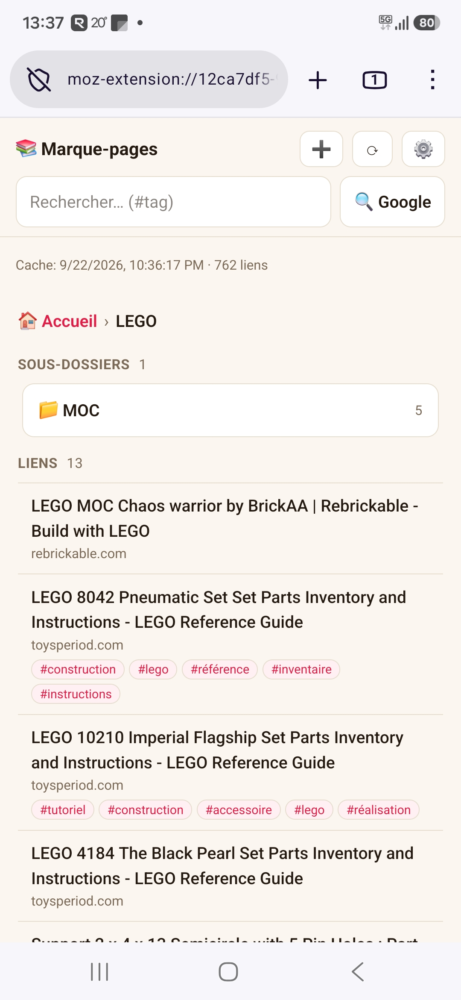

# Firefox Bookmarks — custom Firefox for Android build

A custom Fenix (Firefox for Android) build that ships with:

- the **Symfony Bookmarks** extension pre-installed,
- **uBlock Origin** pre-installed,
- the Symfony Bookmarks **dashboard as the home / new-tab page**.

This repo contains **only the customization** (`firelex-patch/`). It is **not** a fork of
Firefox: the CI checks out upstream `mozilla-firefox/firefox@release` fresh at build time
and overlays these patches on top — no multi-GB Firefox source is mirrored here.

## Screenshot

  

## Build

GitHub Actions → **build-fenix** → **Run workflow** (branch `main`). The APK lands in the
`fenix-debug-apk` artifact (arm64-v8a).

## Download

Each successful run attaches the APK as the **`fenix-debug-apk`** artifact on the
[Actions](../../actions/workflows/build-fenix.yml) run page — download it there and
sideload / `adb install` it. To publish a shareable APK, attach it to a
[GitHub Release](../../releases); binaries are intentionally kept out of git.

## How it works

`firelex-patch/apply.sh` runs in CI after the upstream checkout:

1. copies `overlay/` files into the tree (built-in extensions installer, launcher icon),
2. unzips the bundled extensions into `assets/extensions/`,
3. applies `patches/*.patch` (install the extensions, route the home to the dashboard,
   rename the app).

If a patch stops applying after an upstream `release` bump, the step fails loudly — rebase
that one patch. See `DESIGN.md` (architecture) and `firelex-patch/README.md` (details).
